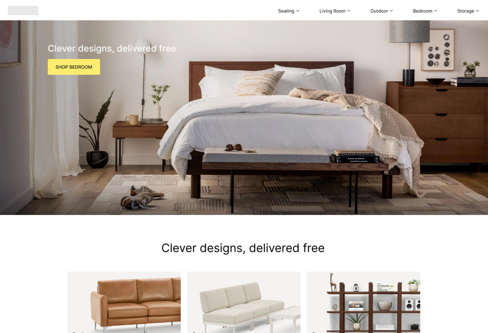
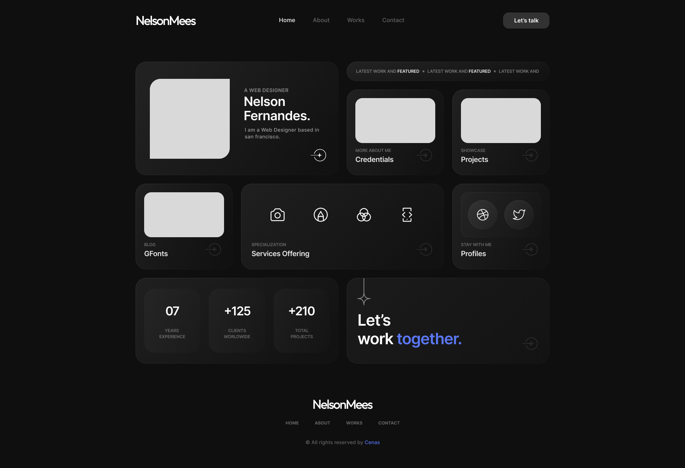
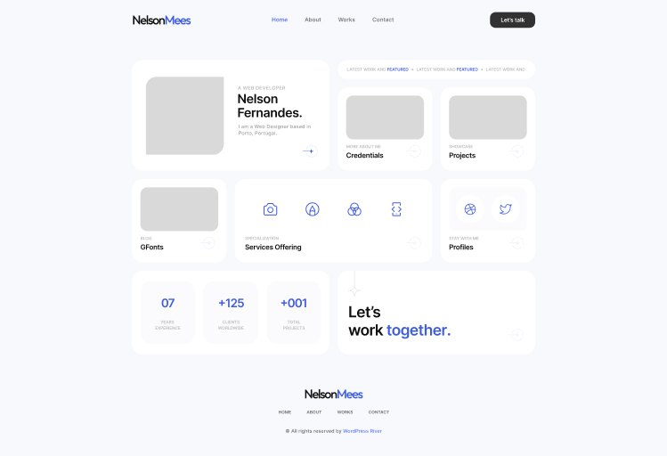

# React Last Challenge

O objetivo de este exercicio é a criação de uma aplicação completa em react.
Podes criar a tua aplicação com recurso ao `CRA` ou `VITE` fica a tua escolha.

## Requisitos da aplicação

**Páginas**

- São necessarias criar pelo menos 3 páginas diferenetes.
- Tem de ser possivel navegar entre estas 3 páginas

**API**

- Deverás pelo menos usar recurso a uma `API` para popular dados na tua aplicação. Está `API` pode ser real ou falsa (construida por vocês)
- Basta umá unica página comunicar com uma `API` não é necessario existir conexão com uma `API` por página

**Componentes**

- Deverás criar componentes com recurso a `functional components` preferencialmente.
- Podes criar a quantidade de componente que quiseres desde que existam componentes uma seleção de componentes simples (Retornam um elemento simples) e componentes compostos (Contem mais do que um componente na sua estrutura)

## Pontos

- Criar uma boa estrutura de componentes (boa estruutura de pastas e nomes dos componentes).
- Respeitar os principios do `DRY` (Do not repeat yourselve) e `KISS` (Keep it stupid simple)
- Utilização de Hooks : `useState` e `useEffect`.
- Utilização do `React Router`.
- Utilização de `CSS Modules` (Pelo menos em 1 componente).
- Documentação simples em como posso proceder a correr o projeto.

## Pontos extra

- Utilização do `Context API`.
- Criaçao de um `Custom Hook` (Hook com lógica criada por vocês).

## Entrega

- O projeto deve ser entregue individualmente num repositorio GIT.
- Devem enviar-me o link para esse repositorio.

**Data de entrega:** ...

# Tematicas

## **Loja online**

**Figma:** https://www.figma.com/file/VltfoSL2Y1bAamvPw1CSjq/React-Final-Store?type=design&node-id=1%3A2&mode=dev

**Dificuldade:** Fácil

## **Curriculo Pessoal**

**Figma:** https://www.figma.com/file/0eYt3ms0pxAiLJrOUim5hw/portefolio_pessoal?type=design&node-id=1%3A552&mode=dev

**Dificuldade:** Médio

## **Projeto Pessoal**

**Figma:** Not provided

**Dificuldade:** Depends (Mas devia ser Dificil)

# Duvidas

Email: invoke.std@gmail.com
Whatsapp: +351938946850
